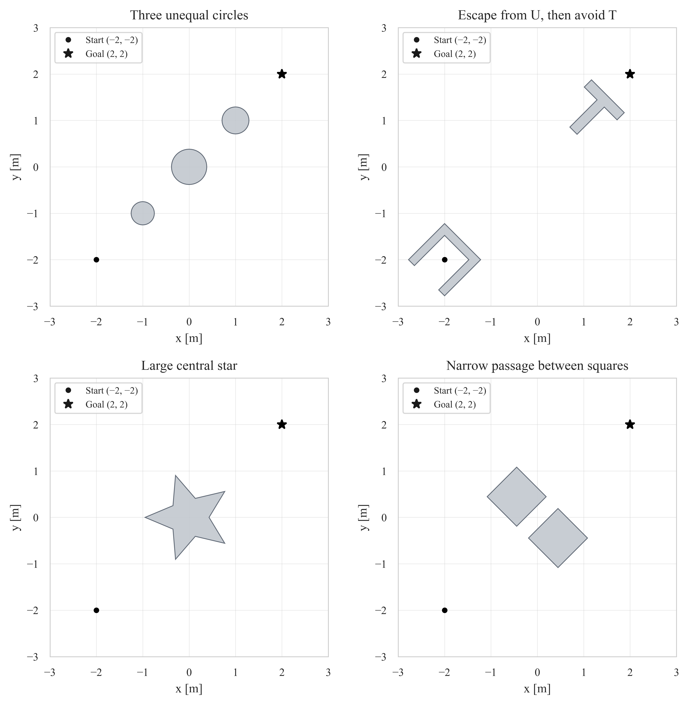
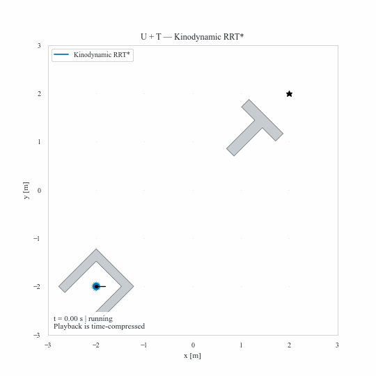
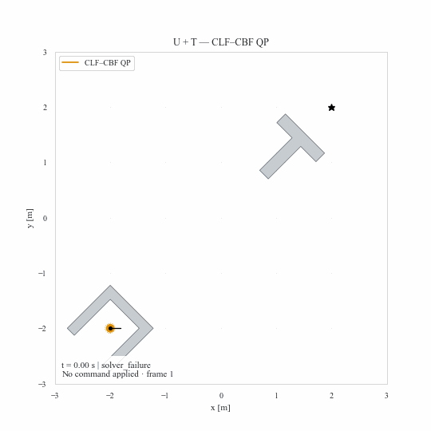
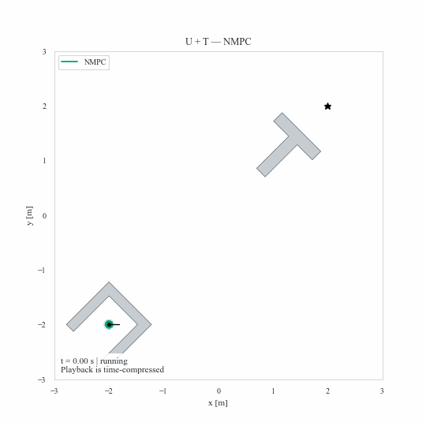
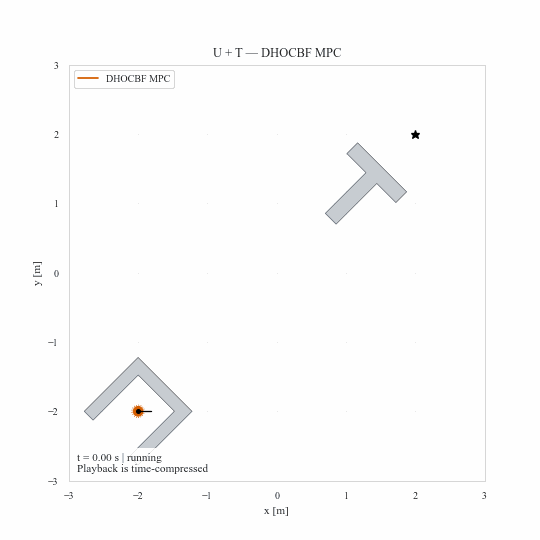
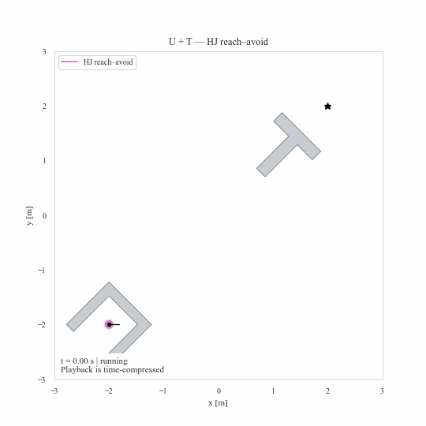
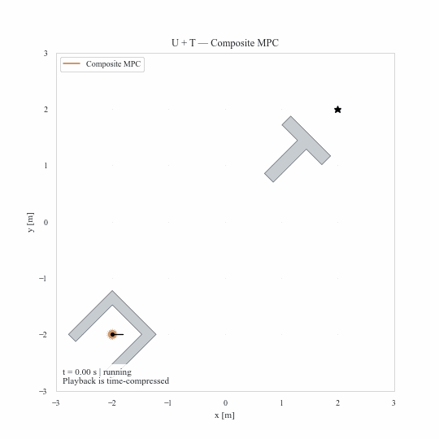
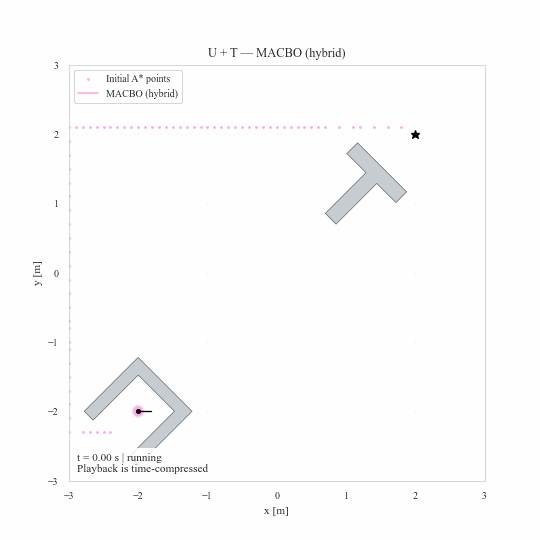

# W-MACBO: Waypoint Memory-Augmented Circulation Barrier Optimization

This repository contains the simulation code and benchmark infrastructure for:

> **Memory-Augmented Circulation Barrier Control for Differential-Drive Navigation**
> Ehsan Forootan, Shervin Mahmoudi, Farbod Khodadadi Aski, and Abolfazl Yaghmaei
> *IEEE Control Systems Letters*, 2026.

The work introduces **Waypoint Memory-Augmented Circulation Barrier Optimization (W-MACBO)** for differential-drive robots navigating known, static environments with non-convex obstacles. The method separates route-level detour selection from local dynamically feasible control: a waypoint planner selects a collision-free route, a decaying memory records persistent waypoint-obstacle attraction, a circulation field biases motion around obstacles, and a constrained wheel-input optimization enforces safety and progress.

The accompanying codebase reproduces the simulation model, W-MACBO implementation, six comparison baselines, the four-map benchmark, scoring/diagnostics, motion-regularity tuning experiments, and validation tests.

---

## Table of Contents

* [Overview](#overview)
* [Method](#method)
* [Benchmark](#benchmark)
* [Repository Structure](#repository-structure)
* [Installation](#installation)
* [Running the Main Benchmark](#running-the-main-benchmark)
* [Running W-MACBO Directly](#running-w-macbo-directly)
* [Running Individual Baselines](#running-individual-baselines)
* [Running the Tests](#running-the-tests)
* [Outputs and Reproducibility Artifacts](#outputs-and-reproducibility-artifacts)
* [Visual Results](#visual-results)
* [Evaluation Metrics](#evaluation-metrics)
* [Important Implementation Notes](#important-implementation-notes)
* [Reproducibility and Scientific Scope](#reproducibility-and-scientific-scope)
* [Literature Baselines](#literature-baselines)
* [Citation](#citation)
* [References](#references)

---

## Overview

Navigation through non-convex environments can require the robot to temporarily move **away from the final goal** in order to escape concave obstacles. A purely local goal-seeking controller can become trapped, while a purely geometric global planner does not necessarily account for the robot's non-holonomic dynamics or wheel limits.

W-MACBO addresses this by combining:

1. **Waypoint routing**
   A grid-based A* search selects a feasible sequence of waypoints and explicitly allows the route to increase goal distance when required by obstacle geometry.

2. **Memory-augmented circulation**
   A decaying memory state records recent attraction of the waypoint field into nearby obstacles. This memory controls the strength of tangential/circulation motion and decays as the robot moves toward the active waypoint.

3. **Barrier-constrained local control**
   A wheel-level constrained optimization problem tracks the desired planar field, promotes phase progress, penalizes excessive wheel motion and wheel-input changes, and enforces hard obstacle-barrier constraints together with bounded wheel inputs.

The method is designed for a differential-drive robot with known dynamics and a known static obstacle map.

---

## Method

### Robot model

The simulator uses the differential-drive model

$$
\dot{x} = g(x)u,
$$

with state

$$
x = [p_x,\;p_y,\;\theta]^T
$$

and wheel-speed input

$$
u = [\omega_R,\;\omega_L]^T.
$$

The benchmark robot parameters are:

| Parameter                    |    Value |
| ---------------------------- | -------: |
| Wheel radius                 |  0.021 m |
| Axle length                  | 0.0884 m |
| Maximum wheel speed          | 10 rad/s |
| Body radius                  |   0.07 m |
| Additional clearance         |   0.02 m |
| Effective safety radius      |   0.09 m |
| Control interval for W-MACBO |   0.05 s |

### Route layer

The W-MACBO planner:

* approximates circular obstacles with circumscribed regular polygons;
* preserves the concavity of U/T/star-shaped obstacles;
* decomposes non-convex polygons into convex components for local barrier construction;
* searches a sparse, axis-aligned grid;
* stores incoming edge direction as part of the A* state;
* includes a turn-delay term in route cost;
* allows both positive and negative coordinate directions;
* refines the grid only after a route-search failure;
* shortens the resulting route only when the replacement segment preserves the required clearance.

The resulting route is stored as both the original graph path and the shortened waypoint sequence.

### Memory and circulation layer

For the active waypoint \(w_j\), W-MACBO constructs waypoint and direct-goal attraction fields. When the waypoint attraction points toward a nearby obstacle, a local tangent direction is selected and a decaying memory state increases circulation strength.

The implementation uses:

* obstacle-localization based on barrier value;
* persistent tangent-sign selection;
* waypoint-distance attenuation;
* exponentially decaying memory;
* explicit obstacle-component active-set selection.

The controller therefore retains information about recent obstacle conflict instead of relying only on the instantaneous local vector field.

### Constrained control layer

At every control update, W-MACBO builds a small constrained optimization problem over normalized wheel inputs and a bounded CLF slack variable.

The objective includes:

* desired planar-velocity tracking;
* phase-dependent progress;
* wheel effort;
* wheel-input change regularization;
* CLF slack relaxation;
* hybrid-mode yaw tracking.

The constraints include:

* hard barrier inequalities for the active convex obstacle components;
* phase-specific CLF progress constraints;
* bounded nonnegative CLF slack;
* physical wheel-speed limits;
* stationary-turn constraints during in-place heading alignment.

The implementation uses **SLSQP** and checks the resulting solution against the nonlinear constraints and the environment's independent whole-interval safety guard.

### Strict and hybrid controller modes

The implementation exposes two modes:

* `clf_mode="strict"` follows the supplied manuscript-style position/full-pose CLF construction more directly.
* `clf_mode="hybrid"` is the documented practical differential-drive adaptation used by the main benchmark. It adds explicit turn/drive/terminal-turn phases, a yaw-tracking term, heading hysteresis, and heading-offset limiting while retaining the hard barrier constraints and bounded slack.

The benchmark uses the **hybrid** implementation.

In the Python code, the method is exposed as the class `MACBO` and factory name `"macbo"` even though the manuscript refers to the full method as **W-MACBO**.

---

## Benchmark

The benchmark uses four fixed scenarios and seven total methods.

### Common task

All methods use:

* start pose: `(-2, -2, 0)`
* goal pose: `(2, 2, pi/2)`
* planning bounds: `[-3, 3] x [-3, 3]`
* horizon: 120 s
* final position tolerance: 0.08 m
* final heading tolerance: 0.2 rad

### Evaluation scenarios



**(a) Three unequal circles**
Three circles are placed along the start-to-goal diagonal.

**(b) U + T**
The robot starts inside/at the base of a concave U-shaped obstacle whose opening faces away from the target and must initially increase its goal distance to escape. A second T-shaped obstacle is placed near the goal.

**(c) Central star**
A large five-point star creates a non-convex central obstacle.

**(d) Narrow passage**
Two rotated square obstacles form a narrow corridor whose width is close to the admissible robot centerline clearance.

The U + T scenario is the most important stress case for the proposed waypoint-memory architecture because successful navigation requires a deliberate temporary departure from the goal direction.

### Compared methods

| Method             | Implementation                                                                 |
| ------------------ | ------------------------------------------------------------------------------ |
| Kinodynamic RRT*   | Seeded RRT* with differential-drive wheel-input steering primitives            |
| CLF-CBF QP         | CLF-CBF quadratic program with conservative circular obstacle representation   |
| NMPC               | Nonlinear direct-shooting MPC with exact held-input dynamics                   |
| DHOCBF MPC         | Route-guided sequential convex MPC with discrete high-order barrier recursions |
| HJ reach-avoid     | Finite-horizon Hamilton-Jacobi reach/avoid value functions                     |
| Composite MPC      | MPC using a soft-min composite barrier                                         |
| **MACBO (hybrid)** | Proposed waypoint + memory + circulation + barrier controller                  |

### Reported manuscript results

Across the four-map benchmark, the manuscript reports that W-MACBO reaches all four target poses without collision. Its reported four-map mean arrival time is **43.5 s**, mean path length is **7.080 m**, and mean online inference time is **2.844 ms**. A motion-regularity tuning study reduces sampled wheel-input-rate RMS by **43.0%** and planar-acceleration RMS by **39.7%**, at an **11.3%** increase in mean arrival time.

For the benchmark as reported in the paper:

| Method         | Goals reached | Mean path length [m] | Mean arrival time [s] |
| -------------- | ------------: | -------------------: | --------------------: |
| RRT*           |           4/4 |                 6.97 |                  44.4 |
| CLF-CBF QP     |           0/4 |                7.57* |                 90.0* |
| NMPC           |           2/4 |                3.56* |                 38.6* |
| DHOCBF MPC     |           3/4 |                4.90* |                 25.7* |
| HJ reach-avoid |           4/4 |                 8.62 |                 116.7 |
| Composite MPC  |           2/4 |                3.56* |                 24.4* |
| **W-MACBO**    |       **4/4** |             **7.08** |              **43.5** |

`*` Failed runs are retained in the descriptive table; these values should be interpreted together with completion and coverage rather than as evidence of superior successful navigation.

The repository also contains the machine-readable benchmark summary in [`summary_table.html`](summary_table.html).

---

## Repository Structure

```text
W-MACBO/
│
├── benchmarks/
│   ├── __init__.py
│   ├── README.md
│   ├── requirements.txt
│   ├── scenarios.py
│   ├── config.py
│   ├── runner.py
│   ├── metrics.py
│   └── plotting.py
│
├── experiments/
│   ├── README.md
│   └── smoothing.py
│
├── methods/
│   ├── __init__.py
│   ├── README.md
│   ├── requirements.txt
│   ├── sources.json
│   ├── common.py
│   ├── experiment.py
│   ├── geometry.py
│   ├── clf_cbf.py
│   ├── mpc.py
│   ├── rrt_star.py
│   ├── hj_reach_avoid.py
│   │
│   └── macbo/
│       ├── __init__.py
│       ├── README.md
│       ├── config.py
│       ├── geometry.py
│       ├── planner.py
│       └── controller.py
│
├── robot_env/
│   ├── __init__.py
│   ├── core.py
│   └── planning.py
│
├── tests/
│   ├── ...
│   ├── methods/
│   ├── macbo/
│   └── smoothing/
│
├── actual_robot_dynamics.csv
├── actual_robot_dynamics_norms.pdf
├── coverage_and_timing.csv
├── mean_actual_robot_dynamics.csv
├── scenario_maps.png
├── summary_table.html
├── trajectory.pdf
├── u_and_t_clf_cbf_qp.gif
├── u_and_t_composite_mpc.gif
├── u_and_t_hj_reach_avoid.gif
├── u_and_t_kinodynamic_rrt_star.gif
├── u_and_t_macbo.gif
├── u_and_t_mpc_dhocbf.gif
├── u_and_t_nmpc.gif
└── requirements.txt
```

### Package responsibilities

#### `robot_env/`

Core simulator and reusable geometric primitives.

* `core.py`
  Defines `Robot`, `Obstacle`, `Environment`, `Rollout`, shape construction, exact differential-drive propagation, obstacle-distance calculations, safety checking, and the generic `simulate` loop.

* `planning.py`
  Contains the original baseline geometric A* planner and waypoint follower. This is distinct from the W-MACBO route planner.

#### `methods/`

Literature baselines and the proposed method.

* `common.py`
  Shared method API, immutable base configurations, pose-error handling, map signatures, wheel scaling, numerical Jacobians, and standardized failure handling.

* `experiment.py`
  Provides the common `Experiment` format and `run_method(...)` execution wrapper. It separates setup time from online controller time, records failed attempts explicitly, stores exact held-input rollouts, and serializes reproducibility metadata.

* `geometry.py`
  Vectorized signed-distance functions, polygon triangulation, convex-component barriers, soft-min aggregation, and DHOCBF recursion helpers.

* `clf_cbf.py`
  Adapted CLF-CBF QP baseline.

* `mpc.py`
  Contains the NMPC, DHOCBF-MPC, and Composite MPC implementations.

* `rrt_star.py`
  Differential-drive kinodynamic RRT* adaptation.

* `hj_reach_avoid.py`
  Finite-horizon HJ reach/avoid implementation.

* `macbo/`
  Full W-MACBO implementation:

  * `config.py`: validated immutable controller and planning hyperparameters.
  * `geometry.py`: obstacle outer approximations, convex decomposition, projections, barrier construction, and active-set selection.
  * `planner.py`: sparse axis-aligned A* with direction-aware cost, refinement, and route shortening.
  * `controller.py`: memory/circulation field construction, phase logic, constrained wheel-input optimization, solver diagnostics, and safety validation.

* `sources.json`
  Source attribution and adaptation notes for the six literature baselines. The repository explicitly identifies these as equation-based research adaptations, not exact reproductions of the original published implementations.

#### `benchmarks/`

Main benchmark orchestration.

* `scenarios.py`: defines the four fixed evaluation maps and common start/goal.
* `config.py`: frozen method configurations and common benchmark settings.
* `runner.py`: executes all 28 method/scenario trials and writes reproducibility artifacts.
* `metrics.py`: independent motion reconstruction, time-weighted scoring, common-objective evaluation, and aggregation.
* `plotting.py`: publication-style static figures, animations, GIF reconstruction, and table rendering.
* `requirements.txt`: additional benchmark dependencies.

#### `experiments/`

Secondary experiments that are not part of the benchmark controller itself.

* `smoothing.py`: evaluates the motion-regularity tuning candidates, computes sampled input-rate and planar-acceleration proxies, and provides model-dynamics norm diagnostics.

The approved `gentler_motion` configuration is now the active benchmark configuration; the historical pre-smoothing design is retained separately by the benchmark artifacts.

#### `tests/`

Validation suites for the environment, method API, literature implementations, MACBO-specific behavior, benchmark logic, dynamics, animation/export behavior, and smoothing diagnostics.

---

## Installation

The codebase uses standard Python scientific-computing packages and does not require an external dataset.

Python 3.10 or newer is recommended because the source uses modern Python type syntax.

### 1. Clone the repository

```bash
git clone https://github.com/FarbodKhodadadi/W-MACBO.git
cd W-MACBO
```

### 2. Create a virtual environment

Linux/macOS:

```bash
python3 -m venv .venv
source .venv/bin/activate
```

Windows:

```powershell
py -m venv .venv
.venv\Scripts\activate
```

### 3. Install benchmark dependencies

From the repository root:

```bash
python -m pip install --upgrade pip
python -m pip install -r benchmarks/requirements.txt
```

`benchmarks/requirements.txt` includes the base and method dependencies through the nested requirements files.

For method development without the benchmark plotting stack:

```bash
python -m pip install -r methods/requirements.txt
```

### Publication figures

The publication plotting code uses **Times New Roman** and explicitly checks that the font is available rather than silently substituting another font.

---

## Running the Main Benchmark

The benchmark entry point is:

```python
from benchmarks.runner import run_benchmark

scenes, trials, per_trial, means, work = run_benchmark(
    "results/benchmarking"
)
```

A direct command-line invocation from the repository root is:

```bash
python -c "from benchmarks.runner import run_benchmark; run_benchmark('results/benchmarking')"
```

This runs the seven methods on all four fixed scenarios, for a total of **28 trials**.

The benchmark runner:

1. creates the common scenarios;
2. constructs the configured controller for each method;
3. executes each trial using exact held wheel commands;
4. saves the complete experiment record immediately;
5. computes independent safety and performance metrics;
6. checks accepted trajectories against the dense safety validation;
7. records method configurations and source fingerprints;
8. writes machine-readable summary files.

### Recommended output directory

```text
results/
└── benchmarking/
    ├── manifest.json
    ├── per_trial_metrics.csv
    ├── mean_metrics.csv
    ├── work_proxies.csv
    └── trials/
        ├── three_circles/
        ├── u_and_t/
        ├── central_star/
        └── square_passage/
```

Each `trials/<scenario>/<method>/` directory contains the serialized scene, rollout, report, and — for MACBO — the route data and common-objective trace.

### Benchmark validation

The benchmark loader checks the saved source SHA-256 fingerprints and active method configurations before treating cached results as current. This is intended to prevent silently mixing stale results with changed source code or parameters.

---

## Running W-MACBO Directly

The public Python API is:

```python
from benchmarks.config import parameters_for, HORIZON, POSITION_TOLERANCE, HEADING_TOLERANCE
from benchmarks.scenarios import GOAL, make_scenarios
from methods import make_method, run_method

scenes = make_scenarios()
environment = scenes["u_and_t"]

controller = make_method(
    "macbo",
    GOAL,
    **parameters_for("macbo")
)

experiment = run_method(
    environment,
    controller,
    horizon=HORIZON,
    position_tolerance=POSITION_TOLERANCE,
    heading_tolerance=HEADING_TOLERANCE,
)

print(experiment.metrics())
```

To inspect the route:

```python
print(controller.graph_path)
print(controller.waypoints)
```

To inspect the saved experiment:

```python
experiment.save("results/my_macbo_run")
```

A saved experiment includes:

* `scene.json`
* `rollout.npz`
* `report.json`

The report contains the method configuration, goal, stopping tolerances, numerical versions, status/failure information, diagnostics, attempted inputs, and map signature.

### Single local example

A minimal custom scene can also be constructed directly:

```python
from robot_env import Environment
from methods import make_method, run_method

env = Environment(bounds=(-1, 1, -1, 1))
env.add("U", (-0.4, 0.0), width=0.45, height=0.55, thickness=0.12, angle=0.3)
env.reset((-0.8, -0.1, 0.0))

controller = make_method(
    "macbo",
    (0.8, 0.15, 0.7),
    grid_spacing=0.2,
    k_c=0.8,
)

experiment = run_method(env, controller, horizon=60.0)
print(experiment.metrics())
experiment.save("results/my_macbo_run")
```

---

## Running Individual Baselines

All literature methods share the same public factory:

```python
from methods import make_method, run_method

method = make_method(
    "nmpc",
    goal,
    dt=0.3,
    horizon_steps=8,
    max_iterations=60,
    seed=7,
)

experiment = run_method(
    environment,
    method,
    horizon=16,
    position_tolerance=0.08,
    heading_tolerance=0.3,
)

print(experiment.metrics())
```

Available factory names are:

```text
kinodynamic_rrt_star
clf_cbf_qp
nmpc
mpc_dhocbf
hj_reach_avoid
composite_mpc
macbo
```

The full default parameter sets are defined in the corresponding immutable configuration dataclasses and, for the paper benchmark, frozen in `benchmarks/config.py`.

---

## Running the Tests

From the repository root:

```bash
python -m unittest discover -s tests -v
python -m unittest discover -s tests/methods -v
python -m unittest discover -s tests/macbo -v
```

The MACBO-specific tests cover:

* equation and objective identities;
* A* versus Dijkstra consistency;
* conservative geometry and concave decomposition;
* route planning and route-shortening behavior;
* configuration validation;
* repeated-call and reset behavior;
* QP feasibility;
* barrier and CLF residuals;
* obstacle avoidance across circles, polygons, stars, U/T obstacles, rotated obstacles, mixed maps, and narrow passages;
* exact within-interval trajectory checks.

The benchmark and smoothing validation additionally check independent clearance sampling, wheel limits, interval acceptance, source/config preservation, dynamics identities, figure export properties, and animation consistency.

Passing these finite test suites validates the tested cases only. It does not establish convergence on arbitrary maps, global optimality, or universal collision avoidance.

---

## Outputs and Reproducibility Artifacts

### Experiment records

Every `Experiment.save(...)` directory contains:

| File          | Description                                                                        |
| ------------- | ---------------------------------------------------------------------------------- |
| `scene.json`  | Initial scene, robot parameters, obstacle geometry, bounds, and state              |
| `rollout.npz` | Accepted states, outputs, wheel commands, margins, timings, and status             |
| `report.json` | Configuration, diagnostics, failures, run options, software versions, and attempts |

### Benchmark records

The benchmark additionally writes:

| File                    | Description                                                                                  |
| ----------------------- | -------------------------------------------------------------------------------------------- |
| `manifest.json`         | Full benchmark configuration, source fingerprints, software versions, and scoring convention |
| `per_trial_metrics.csv` | Machine-readable metrics for every method/scenario pair                                      |
| `mean_metrics.csv`      | Four-map aggregate results                                                                   |
| `work_proxies.csv`      | Algorithm-specific computational-work diagnostics                                            |
| `common_objective.csv`  | Per-interval common-objective evaluation                                                     |
| `route.npz`             | MACBO graph path and shortened waypoints                                                     |

The benchmark records source SHA-256 fingerprints so that cached results can be checked against the source code used to generate them.

### Computational timing

Online timing measures the wall-clock duration of controller calls. Setup/precomputation time is reported separately.

Reported timings are **hardware dependent** and should not be treated as exact cross-platform reproducibility targets. Seeded trajectories and recorded configurations are the reproducibility targets.

---

## Visual Results

### Benchmark maps


`scenario_maps.png` shows the four fixed evaluation environments used for all methods. The U + T map is particularly important because the valid route initially moves away from the final goal direction.

### U + T execution comparison

The GIFs below reconstruct the physical wheel-controlled motion on the U + T scenario. They are intended to show the qualitative difference between global route selection, local optimization, reach-avoid control, and W-MACBO's waypoint-conditioned memory/circulation behavior.

#### Kinodynamic RRT*



The RRT* implementation plans dynamically feasible wheel-input trajectories using rotate/translate/rotate steering primitives with optional reverse motion.

#### CLF-CBF QP



The CLF-CBF baseline uses conservative circular obstacle representations. In particular, non-circular concavities such as the U-shaped cavity are not preserved by this adaptation, which can prevent the method from exploiting physically free space.

#### NMPC



The NMPC baseline performs nonlinear direct shooting with a finite prediction horizon and applies only the first optimized wheel command at each update.

#### DHOCBF MPC



The DHOCBF implementation uses route guidance together with sequential convex optimization and discrete high-order barrier recursions. Each candidate solution is subsequently checked against the nonlinear dynamics and geometry.

#### HJ reach-avoid



The HJ controller uses finite-horizon reach and avoid value functions on a three-dimensional `(x, y, theta)` grid with periodic heading and a finite wheel-control mesh.

#### Composite MPC



The composite controller aggregates smooth convex-component barriers with an unnormalized soft-min and uses a shared scalar slack in the composite barrier decay condition while retaining hard physical occupied-set safety.

#### W-MACBO



The proposed controller first obtains a feasible waypoint route, then uses waypoint attraction, visibility-conditioned goal attraction, decaying obstacle-conflict memory, and circulation to guide the wheel-level constrained optimizer through the concave U and toward the target.

### Publication figures and tables

* [`trajectory.pdf`](trajectory.pdf) — trajectory comparison figure.
* [`summary_table.html`](summary_table.html) — publication-oriented summary table.
* [`actual_robot_dynamics_norms.pdf`](actual_robot_dynamics_norms.pdf) — model-dynamics norm diagnostic.
* [`actual_robot_dynamics.csv`](actual_robot_dynamics.csv) — actual dynamics-derived quantities.
* [`mean_actual_robot_dynamics.csv`](mean_actual_robot_dynamics.csv) — aggregated actual-dynamics quantities.
* [`coverage_and_timing.csv`](coverage_and_timing.csv) — coverage and timing measurements.

The `actual_robot_dynamics_norms` diagnostic is a **model property diagnostic**, not a controller-performance metric: the implemented robot model has zero autonomous drift \(f(x)=0\), while the Frobenius norm of the input matrix \(g(x)\) is state independent.

---

## Evaluation Metrics

The benchmark evaluates more than binary collision avoidance.

### Task completion

A run is successful only when both the final position and final heading satisfy the common stopping tolerances.

### Safety

The simulator uses the physical body radius plus explicit clearance as the safety radius. Accepted trajectories are independently checked at dense points inside each held-input interval in addition to the simulator's conservative interval guard.

### Path length

Path length is the sum of accepted position chords between recorded states.

### Terminal error

Position and heading errors are reported separately, with heading differences wrapped to \([-\pi,\pi]\).

### Runtime

Online solver/controller wall time and setup/preparation time are recorded separately. Mean and P95 online times are reported.

### Common objective

To compare controllers under a common cost, the benchmark evaluates a goal-referenced final-stage MACBO objective on each method's **recorded trajectory**.

Important:

* the evaluator does not solve a replacement control problem;
* it does not modify the actual trajectory;
* virtual MACBO memory is replayed from zero on each method trajectory;
* all methods are evaluated relative to the same final goal;
* the common objective is a scoring device and is not each controller's private stage cost.

The score includes velocity tracking, progress, wheel effort, input-change regularization, and the minimum nonnegative CLF slack required by the candidate derivative. The resulting value can therefore be negative for some candidate intervals because the transformed progress term is not constrained to be nonnegative.

### Motion regularity

The smoothing experiment reports finite-difference proxies for:

* RMS wheel-input rate;
* RMS planar acceleration;
* input total variation;
* peak input jump;
* peak translational speed;
* peak yaw rate.

These are **sampled motion-quality metrics**, not continuous jerk or curvature guarantees.

---

## Important Implementation Notes

### The literature baselines are adaptations

The repository does not claim exact source-code reproduction of the cited baseline papers.

Instead, each baseline is an executable equation-based adaptation to the common differential-drive simulation environment. Specific changes are documented in:

[`methods/README.md`](methods/README.md) and [`methods/sources.json`](methods/sources.json).

Examples include:

* RRT* uses differential-drive wheel primitives rather than the source steering model.
* CLF-CBF QP uses conservative circular enclosures for polygonal obstacles.
* NMPC replaces the source platform/sensing setup with the common differential-drive model and known occupied sets.
* DHOCBF-MPC replaces acceleration/occupancy-grid formulations with wheel inputs and convex-component barriers.
* HJ reach-avoid uses a finite sampled wheel-control set and finite grid.
* Composite MPC implements the supplied soft-min barrier formulation where the complete source article was not available for exact reconstruction.

### No hidden fallback controllers

A solver failure is recorded as a failure. The experiment framework does not silently switch to another controller.

Likewise:

* unsafe commands are rejected;
* changed maps invalidate prepared controller state;
* infeasible bounded-relaxation problems are explicitly reported;
* failed trajectories are not converted into artificial successful trajectories.

### Route assistance is explicit

For the benchmark:

* W-MACBO has its own waypoint route;
* DHOCBF-MPC uses its documented A* route guidance;
* NMPC and Composite MPC are configured with `route_guidance=False`;
* RRT* performs its own sampling-based route construction;
* HJ does not use an A*/RRT tracker.

This distinction matters when interpreting global-versus-local planning comparisons.

### Physical safety versus planning clearance

The physical collision requirement and the route-planning margin are separate quantities.

* The physical safety radius is the robot body radius plus explicit clearance.
* `route_margin` adds additional clearance to the graph planning layer.
* The controller's local barrier constraints operate on the physical robot clearance set.
* The environment also applies an independent whole-interval guard before accepting a held wheel command.

---

## Reproducibility and Scientific Scope

This is an **in-silico algorithmic benchmark**, not a hardware experiment or clinical-style trial.

The core benchmark assumes:

* known static obstacle geometry;
* known differential-drive dynamics;
* bounded wheel speeds;
* deterministic fixed benchmark maps;
* no perception uncertainty;
* no moving obstacles;
* no external disturbances;
* no dynamics-model mismatch.

The four benchmark maps are fixed evaluation scenarios and the method configurations are fixed across those maps. They are not an independent tuning/test split, and the reported benchmark is not intended as a statistical significance study.

The paper demonstrates collision-free completion on the specified four-map benchmark. This should not be generalized to arbitrary environments or interpreted as a universal convergence or safety proof for every map, initial condition, robot parameter, or hyperparameter choice.

Future directions identified by the paper include larger randomized benchmark suites, component-wise sensitivity analysis, uncertainty/model-mismatch analysis, moving obstacles, and eventual hardware implementation.

---

## Literature Baselines

The benchmark implementations correspond to the following sources.

### Kinodynamic RRT*

Karaman, S. and Frazzoli, E.
“Optimal Kinodynamic Motion Planning Using Incremental Sampling-based Methods.”
*49th IEEE Conference on Decision and Control*, 2010.
DOI: `10.1109/CDC.2010.5717430`

### CLF-CBF QP

Huang, J., Liu, Z., Zeng, J., Chi, X., and Su, H.
“Obstacle Avoidance for Unicycle-Modelled Mobile Robots with Time-Varying Control Barrier Functions.”
*IECON*, 2023.
DOI: `10.1109/IECON51785.2023.10312269`

### NMPC

Ismael, O. Y., Almaged, M., and Abdulla, A. I.
“Nonlinear Model Predictive Control-based Collision Avoidance for Mobile Robot.”
*Journal of Robotics and Control*, 2024.
DOI: `10.18196/jrc.v5i1.20615`

### DHOCBF MPC

Liu, S., Mao, Y., and Belta, C. A.
“Safety-Critical Planning and Control for Dynamic Obstacle Avoidance Using Control Barrier Functions.”
*American Control Conference*, 2025.
DOI: `10.23919/ACC63710.2025.11107805`

### HJ reach-avoid

Gong, Z., Li, B., and Herbert, S.
“Reach-Avoid-Stabilize Using Admissible Control Sets.”
*IEEE Conference on Decision and Control*, 2025.
DOI: `10.1109/CDC57313.2025.11312765`

### Composite MPC

Khaledi, M. and Kiumarsi, B.
“Obstacle Avoidance of Mobile Robots Based on Model Predictive Control with Dynamic Control Barrier Functions.”
*European Journal of Control*, 2026.
DOI: `10.1016/j.ejcon.2026.101666`

The exact adaptation choices used in this repository are recorded in [`methods/sources.json`](methods/sources.json).

---

## Citation

Please cite the paper when using W-MACBO, the benchmark, or the accompanying implementation.

```bibtex
@article{Forootan2026WMACBO,
  author  = {
    Ehsan Forootan and
    Shervin Mahmoudi and
    Farbod Khodadadi Aski and
    Abolfazl Yaghmaei
  },
  title   = {Memory-Augmented Circulation Barrier Control for Differential-Drive Navigation},
  journal = {IEEE Control Systems Letters},
  year    = {2026}
}
```

For comparisons against the literature baselines, please also cite the original sources listed above.

---

## References

1. E. Forootan, S. Mahmoudi, F. Khodadadi Aski, and A. Yaghmaei, “Memory-Augmented Circulation Barrier Control for Differential-Drive Navigation,” *IEEE Control Systems Letters*, 2026.
2. S. Karaman and E. Frazzoli, “Optimal Kinodynamic Motion Planning Using Incremental Sampling-based Methods,” CDC, 2010.
3. J. Huang, Z. Liu, J. Zeng, X. Chi, and H. Su, “Obstacle Avoidance for Unicycle-Modelled Mobile Robots with Time-Varying Control Barrier Functions,” IECON, 2023.
4. O. Y. Ismael, M. Almaged, and A. I. Abdulla, “Nonlinear Model Predictive Control-based Collision Avoidance for Mobile Robot,” *Journal of Robotics and Control*, 2024.
5. S. Liu, Y. Mao, and C. A. Belta, “Safety-Critical Planning and Control for Dynamic Obstacle Avoidance Using Control Barrier Functions,” ACC, 2025.
6. Z. Gong, B. Li, and S. Herbert, “Reach-Avoid-Stabilize Using Admissible Control Sets,” CDC, 2025.
7. M. Khaledi and B. Kiumarsi, “Obstacle Avoidance of Mobile Robots Based on Model Predictive Control with Dynamic Control Barrier Functions,” *European Journal of Control*, 2026.

---

## Contact

For questions about the implementation, benchmark configuration, or reproduction of the reported experiments, please use the repository issue tracker or contact the authors of the accompanying paper.

---

## License

This project is licensed under the MIT License. See the [LICENSE](LICENSE)
file for details.
